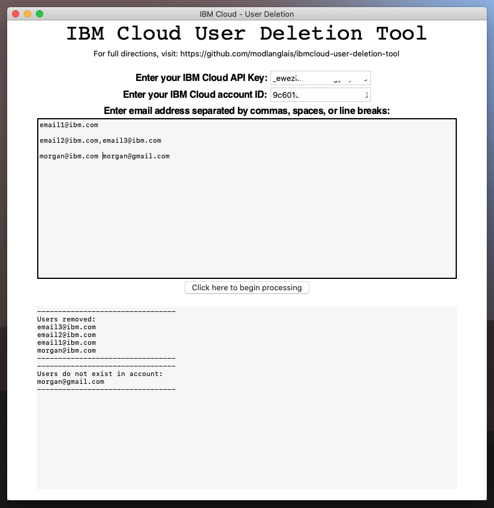

# IBM Cloud User Deletion Tool

### To run the pre-built app:
1. Download and unzip `IBM Cloud User Deletion Tool.zip` then run the application from there.

### To Build
1. `py2applet --make-setup IBM\ Cloud\ User\ Deletion\ Tool.py `
2. `sudo python3 setup.py py2app`
